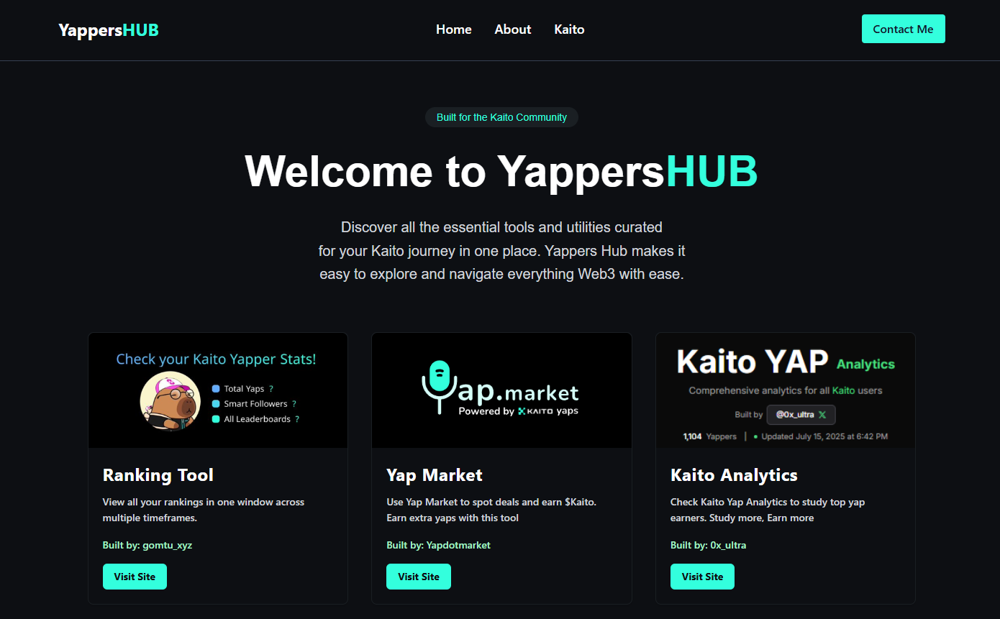

# Yappers Hub 🗣️  

A curated list of **yapping tools** for **Kaito AI Yappers** to create better content, engage consistently, and grow faster.  

## About 📃
This repo contains only **yapping tools** that I’ve collected and tested while participating in the **Kaito Yappers Program**.  
These tools help with:  
- Content creation (ideas, prompts, templates).  
- Engagement (polls, threads, replies).  
- Productivity (time-saving tricks).  

## Yapping Tools ⚙️ 
Each tool is documented with:  
- **Name** → What the tool is called.  
- **Description** → What it does in 1–2 lines.  
- **Usage** → How to apply it in your yapping routine.
- **Site** → Redirect to the tool.
